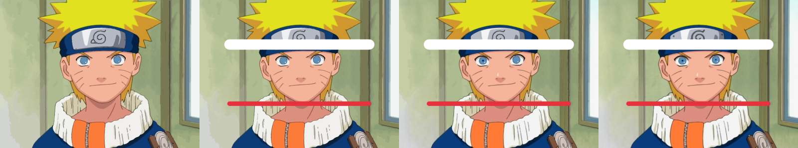

# img2draw — Inverse Drawing / Editable Drawing Reconstruction

Given a raster image, img2draw infers an **editable, replayable drawing
program** (layers, regions, gradients, strokes, correction detail layers)
whose rendering reproduces the source image with very high fidelity.

The representation is *the means*; faithful reconstruction is the primary
objective, with editability/replayability/semantics making it research-worthy.

## Architecture

```
INPUT IMAGE
  -> decompose (gradient bg, KMeans region fills, shadow/highlight splits)
  -> drawing program (JSON project)
  -> renderer (deterministic numpy/OpenCV compositor)
  -> compare with source (MAE/MSE/PSNR/SSIM/MS-SSIM/edge/color/structural/LPIPS)
  -> error-guided refinement: cascade of signed-residual correction layers
  -> editable project -> editor UI -> timeline replay -> export (PNG/WebP/SVG/project)
```

Correction layers store `clip(source - render + 128)` and are composited
with `add_signed` blending. Each layer corrects ±127, so a converged
cascade reproduces the source within renderer quantization; removing them
exposes the pure structured (mostly vector) approximation.

## Layout

```
src/img2draw/        core package
  schema.py          versioned drawing-program schema + project save/load
  renderer.py        compositor + SVG/PNG/WebP export
  metrics.py         fidelity metrics + error maps
  decompose.py       image analysis/decomposition
  planner.py         drawing-plan generation (fast/balanced/high_fidelity)
  pipeline.py        end-to-end pipeline + refinement + CLI
  editor_server.py   FastAPI editor backend
  benchmark.py       benchmark runner -> CSV + HTML report
  animation.py       temporal/animation architecture skeleton
frontend/index.html  editor UI
tests/               pytest suite
examples/            synthetic benchmark images + generator
benchmarks/results/  measured results
third_party/         vendored research repos (submodules)
docs/                documentation
```

## Install & run

```bash
pip install -e .            # or: set PYTHONPATH=src
python examples/make_examples.py examples
python -m img2draw.pipeline examples/logo.png --mode balanced --out out
python -m img2draw.benchmark examples --out benchmarks/results
python -m img2draw.editor_server     # serves UI at http://127.0.0.1:8000
python -m pytest tests -q
```

## Modes

- `fast` — few regions, quick good-enough reconstruction
- `balanced` — regions + correction cascade (default)
- `high_fidelity` — more regions, finer correction
- `research` — alias of high_fidelity

The active mode is stored in the project metadata and displayed in the UI.

## Export

`PNG`, `WebP`, `SVG` (vector ops as real SVG; raster layers embedded as PNG —
SVG cannot faithfully express arbitrary raster detail), and the `.project.json`
format containing canvas, layers, operations, metadata, seed, renderer and
representation versions.

## Third-party research

Vendored for adapter/baseline use (see `THIRD_PARTY_NOTICES.md`):
- **vtracer** (MIT) — raster-to-vector baseline/candidate generator
- **diffvg** (Apache-2.0) — differentiable rendering (optional refinement)
- **LayerTracer** (MIT) — layered sequential design decomposition
- **COVec** (Apache-2.0) — illumination decomposition concepts

These are *wrapped, not copied*. The core system works without building them;
the installed OpenCV contour tracer is the default region vectorizer, and the
iterative correction cascade is the default refinement mechanism.

## Research contribution

Automatic recovery of a **structured sequence of editable drawing operations**
from a finished raster image — jointly considering reconstruction fidelity,
semantic structure, editability, drawing progression, and representation
complexity, with fidelity as the hard constraint.

## Artist-style drawing + live replay

`artist.py` plans the way a person draws: **Outline** (pen strokes traced from ink
lines: skeleton + sub-pixel width) -> **Flat colors** (big blocks, large to small,
sub-pixel contours) -> **Shadows** -> **Highlights** -> **Details** (error-guided
tone shapes) -> **Polish** (small signed touch-up tiles until the canvas equals
the source; `--tol N` stops early).

```bash
python -m img2draw.pipeline some_anime.png --out out/x --video --seconds 30
```
Writes project JSON, `*.stages.png` (stage-by-stage sheet), `*.structure.png`
(before polish), metrics, and `*.replay.mp4`: one continuous video, original on the
left, pen strokes growing with a pen-tip cursor, color shapes spreading from a seed,
polish wiping in. No cuts between stages.

Tested on Luffy / Naruto / Tanjiro (fetched locally into `testdata/`, git-ignored):
final PSNR 100 dB (pixel-exact), structure-only PSNR ~21 dB / SSIM ~0.8-0.86 --
the structured stages carry the look, polish carries the last pixels.

## See it draw

Real output (images are the actual replay, not mock-ups). Each GIF goes outline -> colors -> shading -> details, no cuts:

| Luffy | Tanjiro |
|---|---|
|  |  |

## Editable at any frame

The drawing is a timeline of objects, not a flat video. Edit at any step and the edit
stays in every later step:



Left to right: before the edit, the moment after (a band erased, a red stroke painted),
later in the drawing, and the final frame. The erased band is never repainted and the
brush stroke stays on top. Tools in the web editor (`python -m img2draw.editor_server`,
open http://127.0.0.1:8000): **Select** (click an object, delete or recolor it),
**Brush**, **Eraser**, undo/redo, a timeline scrubber, play, and "Watch as video".

How it works: every op has an `id` and a time `t`; edits are ops with fractional `t`.
`renderer.State` replays the timeline, keeps a *protect mask* so later ops cannot
paint over an erase or brush, and replays from scratch for delete/recolor. Final
detail patches are per-object (`target`), so deleting an object also drops its detail.

## Limitations

- Vector layer reconstruction is approximate for noisy/photographic content;
  the correction cascade carries the difference (an honest detail layer).
- DiffVG-based gradient refinement and full LayerTracer/COVec integration are
  adapter/baseline points, not enabled by default.
- Animation is an architectural skeleton, not a finished temporal pipeline.

## License

MIT for this project's code. Vendored repos keep their own licenses (see
`THIRD_PARTY_NOTICES.md`).

## Try it in the browser (GitHub Pages)

The same editor runs fully in the browser: Python (numpy, OpenCV, scikit-learn) is
loaded with Pyodide, so there is no server. Images are downscaled to 480 px and
planning takes ~15-60 s. The "Watch as video" export needs the local server.
Build locally with `python tools/build_site.py` (output in `site/`); the
`pages.yml` workflow publishes it on push to `master` (enable Pages -> Source:
GitHub Actions).
